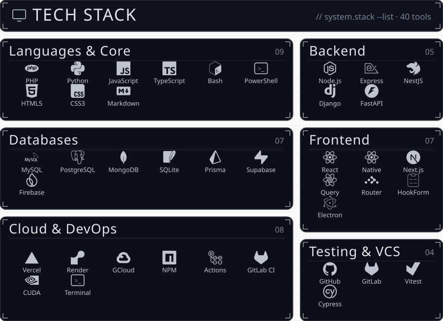

  

  Full-stack web developer — React, Node & TypeScript. I build web apps,
  clean UIs, and well-tested code.

<h2 align="center">🛰️ &nbsp;Socials</h2>

  
  
  

 

<h2 align="center">📊 &nbsp;GitHub Stats</h2>

  
  

  

  

 

  

